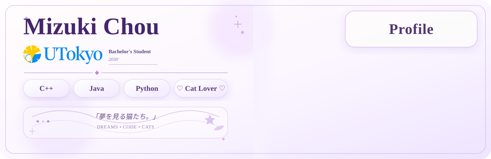

# 🌙 Mizuki Chou

 

  <i>Building small worlds with code.</i>

 

<!-- ═══════════════════════════════════════════════════════════ -->

<!--                         ABOUT                              -->

<!-- ═══════════════════════════════════════════════════════════ -->

<h2>🌸 About Me</h2>

  🎓 Bachelor's Student at <strong>The University of Tokyo</strong> 
  💻 Software & Game Systems Developer 
  🐱 Cat lover

  I enjoy turning ideas into software, game systems, and little worlds.

 

<!-- ═══════════════════════════════════════════════════════════ -->

<!--                      LANGUAGES                             -->

<!-- ═══════════════════════════════════════════════════════════ -->

<h2>💜 Languages</h2>

 

<!-- ═══════════════════════════════════════════════════════════ -->

<!--                    CURRENT PROJECTS                         -->

<!-- ═══════════════════════════════════════════════════════════ -->

<h2>🐱 Current Projects</h2>

<table>
<tr>

<td align="center" width="50%">

<h3>🐱 Neko n' Yume</h3>

A custom Minecraft RPG plugin built with Paper.

<code>Java</code>
<code>Paper</code>
<code>Gradle</code>

</td>

<td align="center" width="50%">

<h3>🌙 Neko-time</h3>

A Minecraft survival world built around
custom systems and gameplay.

<code>Minecraft</code>
<code>Paper</code>
<code>RPG</code>

</td>

</tr>
</table>

 

<!-- ═══════════════════════════════════════════════════════════ -->

<!--                         STACK                               -->

<!-- ═══════════════════════════════════════════════════════════ -->

<h2>⚙️ Tech Stack</h2>

  

  
  
  

 

<!-- ═══════════════════════════════════════════════════════════ -->

<!--                       GITHUB STATS                          -->

<!-- ═══════════════════════════════════════════════════════════ -->

<h2>📊 GitHub</h2>

  

 

<!-- ═══════════════════════════════════════════════════════════ -->

<!--                     GITHUB STREAK                          -->

<!-- ═══════════════════════════════════════════════════════════ -->

<h2>✨ Contribution</h2>

  

 

<!-- ═══════════════════════════════════════════════════════════ -->

<!--                   CONTRIBUTION SNAKE                        -->

<!-- ═══════════════════════════════════════════════════════════ -->

  

 

<!-- ═══════════════════════════════════════════════════════════ -->

<!--                    WHAT I'M DOING                           -->

<!-- ═══════════════════════════════════════════════════════════ -->

<h2>🌱 What I'm Working On</h2>

<table>
<tr>

<td align="center">
  🐱 
  <strong>Neko n' Yume</strong> 
  Minecraft RPG systems
</td>

<td align="center">
  ⚙️ 
  <strong>Game Systems</strong> 
  Entities · Skills · Progression
</td>

<td align="center">
  💻 
  <strong>Programming</strong> 
  C++ · Java · Python
</td>

</tr>
</table>

 

<!-- ═══════════════════════════════════════════════════════════ -->

<!--                       PROJECT                              -->

<!-- ═══════════════════════════════════════════════════════════ -->

<h2>🌸 Featured Project</h2>

  

 

<!-- ═══════════════════════════════════════════════════════════ -->

<!--                         FOOTER                              -->

<!-- ═══════════════════════════════════════════════════════════ -->

  🌙 <i>Building small worlds with code.</i>

  🐱 ✦ 🌸 ✦ ☾ ✦ 🌸 ✦ 🐱

  「夢を見る猫たち。」

 

